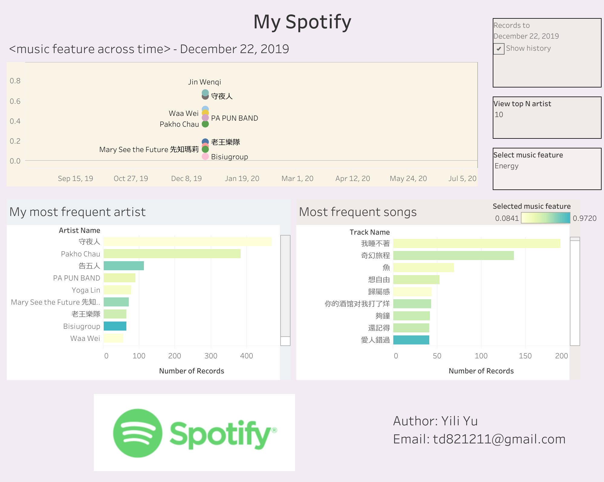

# My_Spotify

I listened to music on Spotify although not very frequently, but I am still curious about the type of music and the artist that I tend to listen more. Hence, as a data enthusiast, I utilize the Spotify api and some analytical tools to visualize my music records.

------

**Tools**

-- Python

-- Jupyter Notebook

-- Tableau 

------

**My Approach**

-- Download you Spotify record via Spotify account

-- Utilize Spotify API to grab detailed information of the songs

-- Python data cleaning and extracting

-- Tableau Dashboard

I focus on studying the features (Dancibility, Liveness, Loundness) in the songs and the artist, which can imply what category of songs you tend to listen more. Also from the history record, you can look into every month and probably find out some songs that you listened a lot in that period but you didn't keep listening them. It helps me retrieve my fav songs that accidentally lost in my records!

**Dashboard**

[Tableau Public link](https://public.tableau.com/profile/yili.yu#!/vizhome/Book1_15938422650700/Dashboard2?publish=yes)
